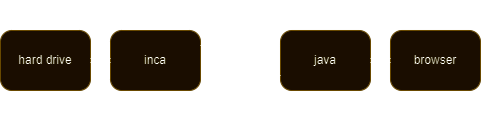

# Media Viewer 
Windows - Chrome, Firefox, Edge, Opera, Brave  
YouTube style interface for your hard drive  
 
    
  

# Features: 
beautiful fast interface 
6 x 6 Video thumbsheets 
Shuffle folders & playlists 
Search, organize, edit & view media files in browser 
Move, Copy, Rename media in browser 
Create slideshows, captions, subtitle tracking, favorites, clips, joins, conversions etc. 
Music and playlists from browser tabs 
Sleep timer gradually lowers master volume when mouse quiet 
To see if you already have a video from an outside website, 
Select part of the title text then 'long click' on it 
A new tab will show all matching files from your computer 

Lightweight & portable (no installation) 
Pure vanilla java / ahk script 
No IDE, no libraries, no external calls, no browser extensions  
Does not mess with any settings - see source code 
Supports most media - mp4, wmv, avi, mpg, mkv etc. 
Configure your settings.ini in notepad, then run compile.exe 
Browser will default open in pictures folder. Add bookmark for it  
To 'uninstall', exit from taskbar & delete inca folder 
You can edit source code in notepad 
Compiles in under a second  

Middle click
- next media (long click for previous) 
- toggle list or thumb view

Back click
- exit media or osk
- or page top
- or reset page

Long click
- over media - show 6 x 6 thumbsheet
- on white space - return to last media
- on selected text - find media matches
- on folder - copies selected files (instead of move)

Long right click
- over media - restarts at 0
- else restarts to default time

Right click & slide
- volume

Left click & slide
- position media
- pop thumbs out of page

6x6 thumbsheets index at about 20 videos per minute 
Supports rotated screen + osk onscreen keyboard 
set compile.exe to run as administrator if using osk 
then click any text area for osk 
Long click on selected text for file search  
     
1m x 12mm threaded rod, 2 x nuts + heatshrink 
drill 12mm hole in wood to bend arm and for cables 
drill 20mm hole for top and bottom nuts  

