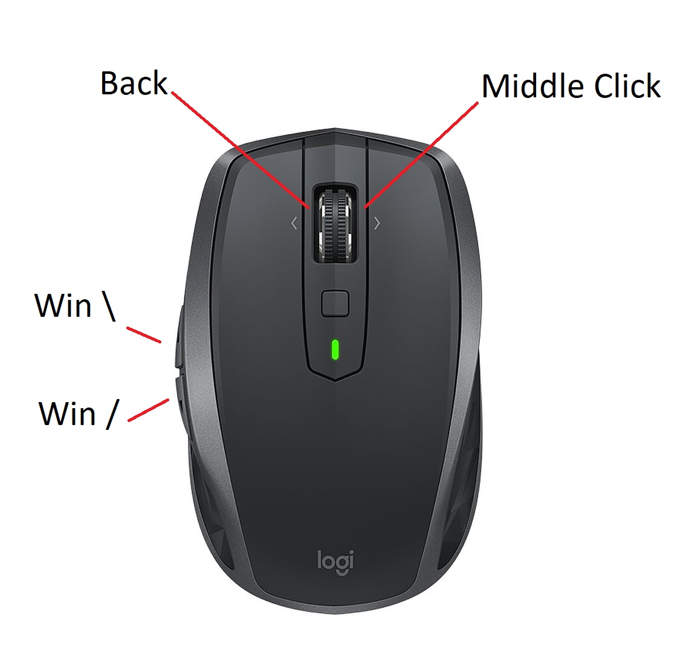

Windows - firefox and chrome compatible 
# File explorer, media viewer for disabled

Creates web pages of your local media 
Like putting 'File Explorer' in your browser 
Commercial looking website for your own movies 

Only 91kB of easy to read AutoHotkey scripting language 
Is lightweight, no installation, does not crash or mess with any files 

# Features:

Frame accurate video filmstrips in browser - (not just few seconds) 
6 x 6 clickable video thumbsheets. (middle click) 
Create instant 10 sec. slo-mo snips, up to 10 per video (long right click) 
Random shuffle - make collections look new again 
Speed, pitch, width, magnify & volume mouse gesture controls  

  

 

  

If you are bedridden or disabled 
No keyboard is needed. Uses long clicks, middle button & mouse gestures 
Just run Ince.exe - browser will open in pictures folder 
To 'uninstall', just close from taskbar tray and delete the inca folder 

YouTube style film strip beneath video 
Smooth Gif playback  with magnify, width, step forward & backward & play/pause 
Find, organize, edit & view media files in browser 
10 second snips/gifs, favorites, history, slideshows  
Background music playlists from browser tab 
Flip sound between music and video with volume-through-zero mouse gesture 
Add silence & reset volume between music tracks. 
Sleep timer gradually lowers volume if mouse quiet 
When browser close to screen edge, Snaps browser to make scroll bar and tabs easier to click 

To see if you already have a video seen on another site, 
Select part of the title text then 'long click' on it 
A tab will immediately open with all matching files from your computer 

First use of folder needs time to index videos, but then everything is very fast. 
(Thumbnails index at about 250 videos per hour into the cache once only) 

Written in a simple scripting language - AutoHotkey 
If it's not exactly what you want, change it. It re-compiles in under a second 
You don't need to be a programmer and it's really easy to customize. 
Just snip out the bits you don't like and write any features you want. 
Both Source and Compile buttons are in settings on the opening browser tab 

# Usage

Click
- on image - next image
- on video - toggle pause
- on thumbnail - play from frame
- on folder - show media inside
- on search term - find matching videos

Long click
- on background - toggle list / thumbs view
- on folder - refresh cache
- on video link - play from start
- on highlighted text - search media files for title match
- in video - slide down for speed, up for pitch

Long right click
- on image - save image under cursor
- on media - add favorite + create 10 second frame accurate gif/mp4 snip

Slide gestures
- in media - magnify, width, speed, volume or pitch
- screen far left - browser magnify

Right click slide gesture
- volume control

Middle click
- on image - next image
- on video - show 6 x 6 thumb sheet
- on background - return to last media at position
- on folder - open in new tab
- on screen far left - next song in playlist

Back click
- in media - exit
- on background - top of page (then previous page)

Long back click
- on image - previous image
- in browser - close current tab
- in other app - close app

Win + \
- toggle browser & desktop - Toggle FullScreen - (copy instead of move files)

Win + /
- pause/play YouTube - reverse 10 seconds YouTube 

  Supports rotated screen & onscreen keyboard tool 
long press on any text for keyboard, back click to close (if run as administrator) 

   
 

