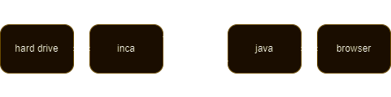
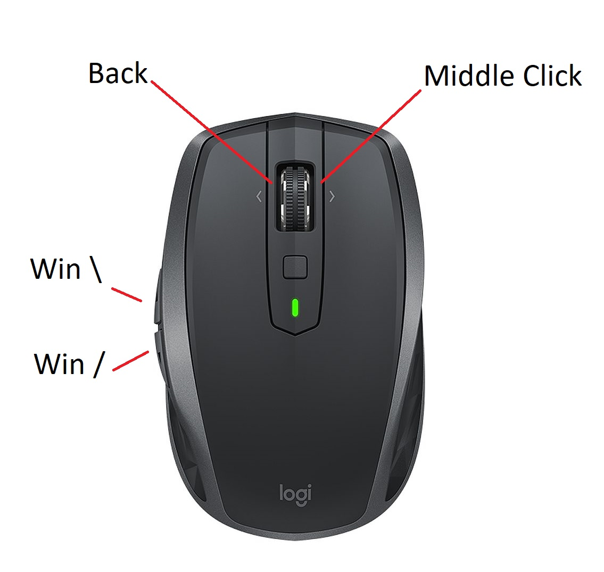

# Inca 
Windows - Chrome, Firefox, Edge, Opera or Brave 
YouTube style interface for your local media with AI creation tools 
includes self hosted voice cloning, caption extraction and editing 
create your own movies & stories with your own dialog and voices from your own assets 

Set start times, skips, pauses, skinny, pitch, speed 
non destructive caption edits, cloned voices, cut ins, cut outs, cuts to  
General filing - move, delete, copy, favorite, mp3, jpg, cuts, joins, conversions 
buttery smooth playback and seeking in browsers  
 
    
  

# Features: 
beautiful fast interface 
6 x 6 video thumbsheets 
Shuffle folders & playlists 
Search, organize, edit & view media files in browser 
Move, Copy, Rename files in browser 
Create slideshows, favorites, clips, joins, conversions etc. 
Create, edit or search captions and subtitles 
Concurrent Music and playlists from browser tabs  
New... uses node server instead of local files 
New... uses Chatterbox and Faster Whisper for voice cloning and caption editing locally 
New... supports elevenlabs and venice external api's 
New... top and tail jpg's and clip splits and joins for AI generated content 

Lightweight & portable (no installation) 
Pure vanilla java / ahk script (ai can confirm is safe) 
No IDE, no libraries, no external calls, no browser extensions  
Does not mess with any settings - see source code  
All media types supported in browser - fast transcode if needed. 
Edit settings or source code in notepad, then run inca.exe 
Compiles in less than 1 second 
Browser will default to pictures folder, bookmark this tab 
To exit, use taskbar or press ctrl + Esc 
To 'uninstall', delete inca folder 

Middle click
- next media (long click for previous) 
- toggle list view or thumb view

Back click
- exit media, context or osk
- or top of page
- or reload page

Long back click
- close browser tab or close window

Long left click
- over text - opens on screen keyboard
- over selected text in browser - lists file matches on pc
- over thumb - pops thumb out of page flow
- over folder - copies selected files (instead of move)

Right click & slide
- volume

Double Right click
- 6 x 6 thumb sheet

Left click & slide
- position player
- select media

Wheel
- Seek (+click = zoom)  

index creates 6 x 6 thumbsheets 
mp4 converts video to browser optimized mp4  
text or mp4 editing sends original copies to trash / recycle bin  
     
1m x 12mm threaded rod, 2 x nuts + heatshrink 
drill 12mm hole in wood to bend arm and for cables 
drill 20mm hole for top and bottom nuts  

