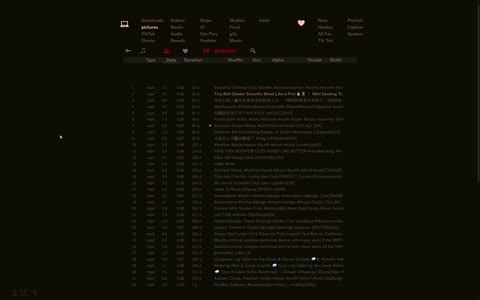
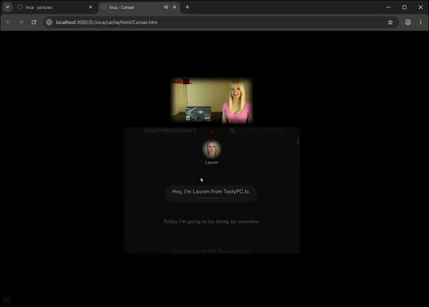
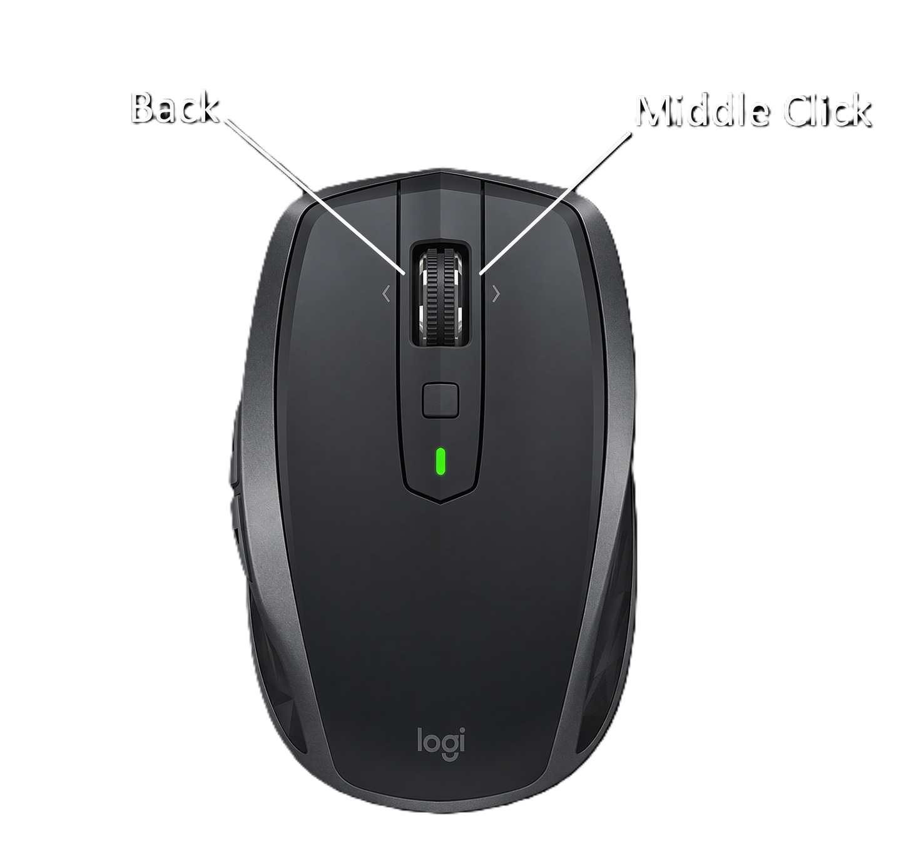

# Inca

**Windows File Explorer, in a YouTube-style browser tab.**

Browse, play, file, and remix your own photos, videos, audio, captions, and text.

Works in Chrome, Firefox, Edge, Opera, and Brave on Windows.

---

## What it is

Inca is a portable media viewer for media you already own.

Think of it as a new way to enjoy existing media locally 
through the process of active creation rather than passive playback  

It treats your folders like a library you can *play* and *reshape* 
shuffle a folder, build a playlist, write captions 
clone a voice, change pitch and speed, cut and join clips 
then keep going. Originals stay safe. Edits are non-destructive.

<table>
<tr>
<td align="center">selecting </td>
<td align="center">cloning </td>
<td align="center">editing </td>
<td align="center">skinny </td>
</tr>
</table>

Use it to:

- File and organize (move, copy, rename, favorite, convert)
- Edit captions, subtitles and voices on images, video or text
- Clone voices locally or via APIs
- Build persistent pathways and storyboards from your own files
- Change names, voices, cuts, timing, captions and story into evolving arcs
- So take any media sources and build your own stories around them

---

## Features

### Browse and play

- Fast, media-first interface
- 6×6 video thumbsheets
- Shuffle folders and playlists
- Search, sort, and view files in the browser
- Concurrent music / playlists across browser tabs
- Smooth playback of any media format using transcode

### File without leaving the tab

- Move, copy, rename, delete
- Favorites and history
- Slideshows, clips, joins, conversions
- `index` builds 6×6 thumbsheets
- `mp4` converts to a browser-friendly video
- Generated text or MP4 copies go to Recycle Bin so you can restore the original

### Remix, don’t destroy

- Set start times, skips, pauses, skinny, pitch, and speed
- Cut scenes in or out of existing media or edit them in place
- Non-destructive caption and subtitle create / edit / search
- Change names, story, voices, and cuts on existing images, movies, text, or captions
- Build cascading pathways and storyboards that persist and evolve
- Top-and-tail JPGs plus clip split/join — useful for AI-generated content

### Voice

- Local voice cloning and caption work with **Chatterbox** and **Parakeet**
- Optional external APIs: **ElevenLabs** and **Venice**

### Built to stay out of the way

- Lightweight and portable — no installer
- Vanilla JavaScript + AutoHotkey + a small Node server
- No IDE, no extra libraries, no browser extensions
- Does not change Windows or browser settings
- Source is plain files you can open in Notepad
- `inca.exe` self-compiles instantly

---

## Mouse and gestures

| Action | What it does |
| --- | --- |
| **Middle click** | Next media *(long click = previous)* Toggles list / thumb view |
| **Back click** | Exit media / menu / on-screen keyboard jump to top or reload |
| **Long back click** | Close the tab or window |
| **Long left click** | Over text → on-screen keyboard Over selected text → find matching files on the PC Over a thumb → pop it out of the page Over a folder → copy selected files (instead of move) |
| **Right click + slide** | Volume |
| **Left click + slide** | Move the player, or select media |
| **Double right click** | 6×6 thumbsheet |
| **Wheel** | Seek *(wheel + click = zoom)* |

---

## Getting started

1. Run `inca.exe` from the Inca folder. No install.
2. The browser opens on your **Pictures** folder. Bookmark that tab.
3. Play, file, caption, or remix from there.

**Exit:** taskbar, or `Ctrl + Esc`.

**Remove:** delete the Inca folder.

Want to tweak behavior? 
Edit the source or settings in Notepad (an assistant can help) 
then run `inca.exe` again. It recompiles instantly.

---

## How editing stays safe

Edits are non-destructive.

- Playback tweaks (pitch, speed, start, skips, skinny) live on the pathway, not as a baked-over original.
- Caption changes do not have to overwrite the source subtitle.
- When Inca generates a new MP4 or text file, the previous file is sent to the Recycle Bin so you can restore it.

The idea is a growing web of versions and pathways from media you already have — not a one-way render.

---

## Optional desk arm

Because it is mouse-focused, it is usable for people who are disabled or bedridden An on-screen keyboard appears when needed for search, captions etc.

1. 1 m × 12 mm threaded rod, two nuts, heatshrink
2. Drill a 12 mm hole in wood to bend the arm and run cables
3. Drill a 20 mm hole for the top and bottom nuts

      

---

## Requirements

- Windows
- Chrome, Firefox, Edge, Opera, or Brave
- No extra installers, IDEs, or extensions

Optional: Chatterbox / Parakeet for local voice; ElevenLabs or Venice if you use those APIs.

---

## Source

JavaScript, AutoHotkey, CSS, and a small Node server. Everything is in the repo.
