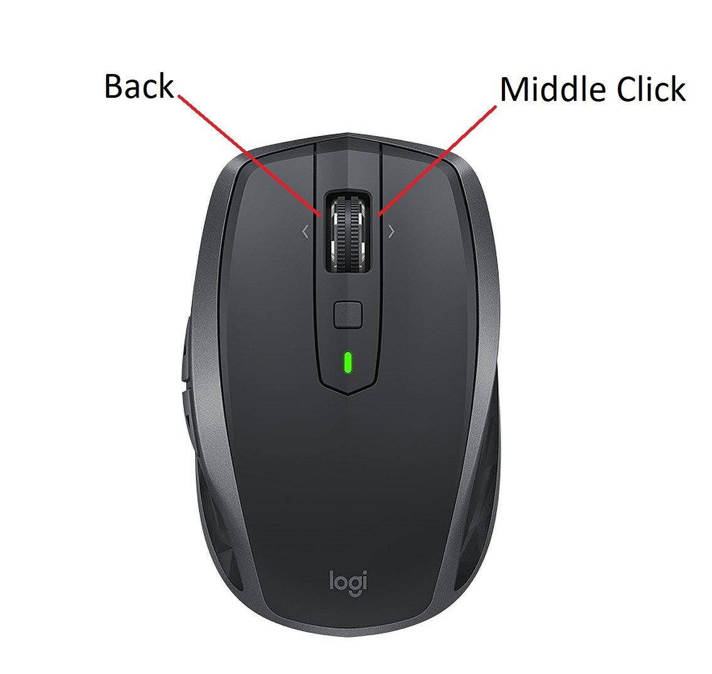

# A browser based file explorer & media viewer 

Windows - firefox and chrome compatible 
YouTube style view of your local media files  
Foreground and background media playlists and players 
Playlists are plain text .m3u files of pointers to media 

Only 79kB of easy to read AutoHotkey script 
Is lightweight, portable (no installation), does not mess with any media or settings 

# Features:

All common media formats 
6 x 6 Video thumbsheets. (middle click) 
Randomize / shuffle folders, media, playlists 
Speed, width, magnify & volume with mouse gestures  

>
 

  

No keyboard is needed. (although supports osk) 
Uses long clicks, mouse gestures, middle click & back button 
Just run Ince.exe - browser will open in pictures folder 
To 'uninstall', just close from taskbar tray and delete the inca folder  

Smooth Gif playback with magnify, width, step forward & backward & play/pause 
Search, organize, edit & view media files in browser 
Add captions to images & video 
Create Favorites, history, slideshows, storylines  
Background music playlists from browser tab 
Flip sound between background music playlist and forground video 
Sleep timer gradually lowers master volume when mouse quiet  

To see if you already have a video from an outside website, 
Select part of the title text then 'long click' on it 
A tab will immediately open with all matching files from your computer 

thumbnails index at about 1000 videos per hour into the cache once only 
Then everything is very fast. 

Written in a simple scripting language - AutoHotkey 
If it's not exactly what you want, change it. It re-compiles in under a second 
You don't need to be a programmer and it's really easy to customize. 
Just snip out the bits you don't like and write any features you want. 
Edit and Compile your script all within browser 

# Usage

Click
- on image - next image
- on video - play/pause
- on thumbnail - play from frame
- on folder - show media inside
- on search term - find matching videos

Long click
- on background - return to last media
- on video link - play from start
- on highlighted text - search media files for match

Long right click
- on media - adds timestamp to favorites & slides playlist

Slide gestures
- in media - magnify, width
- screen far left - browser magnify or media speed

Right click slide gesture
- volume control

Middle click
- on video - show 6 x 6 thumb sheet
- on background - toogle thumbnails / list view
- on folder - open in new tab
- on screen far left - next song in music playlist

Back click
- in media - exit
- on background - clear selection, top of page
- on screen far left - previous song in music playlist

Long back click
- on image - previous image
- in browser - close current tab
- in other app - close app

Win + \
- toggle browser & desktop - Long press - Toggle FullScreen

Win + /
- pause/play YouTube - Long press - back 10 seconds YouTube 

  Supports rotated screen & osk onscreen keyboard 
long press on any text for osk, back click to close (if osk run as administrator) 

   
 

